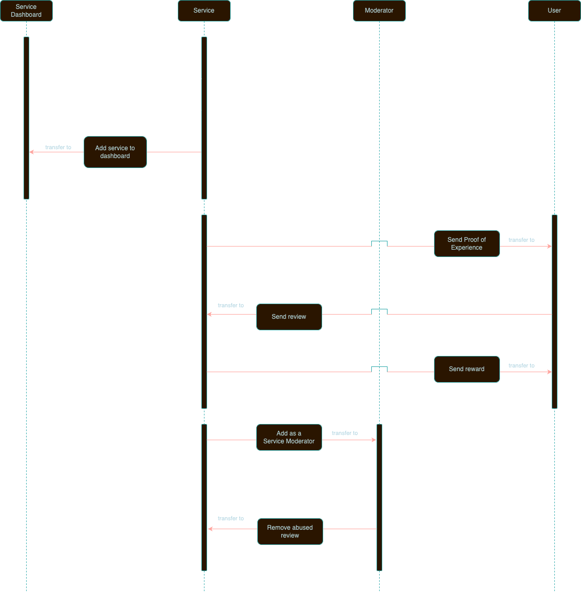

# REVIEWS / RATINGS

On-chain review platform for food services industry.
Leverage blockchain to allow reviewers to own and monetize their feedback, while ensuring transparency and providing reward-based incentives.

## Personas
- Service Owner
  - Lists their service on the platform
  - Creates rewards pool to give incentives to reviewers
  - Generates a Proof of Experience (PoE) NFT for reviewer who can burn it to submit a higher rated review
- Reviewer
  - Writes reviews
  - Collects rewards from writing their reviews
- Consumer
  - Reads review to make inform decisions
  - Pays to access premium reviews
  - Rates a review by casting upvote/downvote
- Moderator
  - Deletes reviews that contain inappropriate content

## Project Structure
The project is structured into two main directories:
- `app/`: Contains the front-end code.
- `move/`: Includes the smart contracts written in Sui Move.

## Prerequisites for testing review platform locally on your machine with Testnet | Devnet Deployment
To get started, you need:
- A Sui address with SUI coins.
- Sui Client CLI configured to connect to the Sui Testnet.
- A Sui-compatible wallet (like Sui Wallet).
- npm and Node.js installed on your machine.

## Using the Review Platform
Follow these steps to set up and interact locally:

### Testnet | Devnet Deployment
1. Switch to the desired environment with `sui client switch --env testnet|devnet`.
2. Ensure your active Sui address has sufficient SUI coins.
3. Move to the `setup/` directory and follow the detailed instructions from the README file.
4. Deploy the contract and setup the environment with `./publish testnet | devnet`.

### App Setup
1. Move to the `app/` directory and run `npm install`.
2. Open `api/.env` and add `NEXT_PUBLIC_DASHBOARD_ID=deployed_dashboard_id`.
3. Make sure correct values are set in `app/.env` for `NEXT_PUBLIC_PACKAGE` and `NEXT_PUBLIC_SUI_NETWORK`.

The `publish` script deploys the contract and initializes the environment. For more details, refer to the `publish` README.

### UI Interaction
1. Navigate to the `app/` directory.
2. Run `npm install`, followed by `npm run dev` for local testing.
3. Access the UI at `localhost:3000`.
4. You can follow the app/README.md file for more information.

## Sequencial diagram

